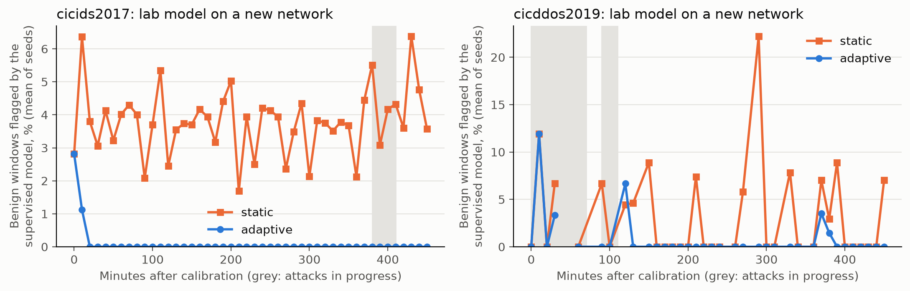
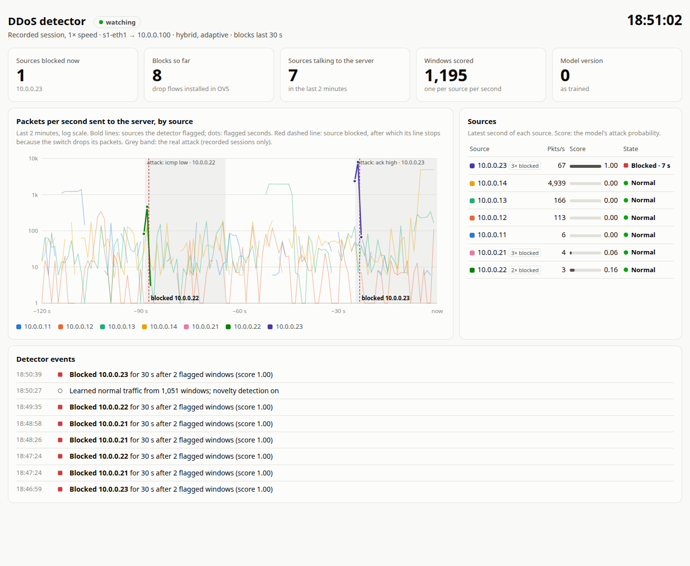

# Adaptive ML-Based Real-Time Detection of DDoS Attacks

Course project by Md. Asif Mustoba Sazzad, Jaba Anika Kotha and Md. Arefin Iqram.
The proposal is in [docs/Adaptive ML DDoS Detection.pdf](docs/Adaptive%20ML%20DDoS%20Detection.pdf).

The code has two pipelines:

- **v2 (in progress):** follows the proposal. A Mininet lab with separate benign clients and
  attackers, per-source-IP time-window features, and labels taken from the logged attack schedule.
- **v1 (first prototype):** 100-packet windows from four Mininet pcaps, RF / KNN / SVM, and a
  socket server. Its "Normal" class is mostly attack traffic (see Known issues), so its 95%
  accuracy does not measure detection.

## Implementation plan

| Phase | Proposal contribution | Status |
|---|---|---|
| 0 | Clean data and honest evaluation (prerequisite) | done: 3 lab sessions, baselines in reports/lab |
| 1 | 02 Cross-dataset eval: lab + CIC-DDoS2019 + CIC-IDS2017 + Kaggle SDN | done: reports/cross_dataset |
| 2 | 04 DL comparison: 1D-CNN, LSTM, Transformer vs RF/XGBoost | done: reports/models |
| 3 | 03 Real-time closed-loop mitigation (OVS drop flows) | done: reports/mitigation |
| 4 | 01 Adaptive pipeline: drift detection, online learning, novelty detection | done (simulation): reports/adaptive |
| 5 | 05 Deployment-ready architecture | done: deploy/, reports/mitigation |

## Folder structure

```
ddos/                       Python package (run every module from the project root)
  config.py                 all paths, label names and the window length, in one place
  lab/                      Mininet lab, stdlib only (run with sudo python3)
    scenario.py               address plan + seeded attack schedule
    topology.py               OVS switch without controller, victim on port s1-eth1
    benign.py                 benign client traffic: HTTP, ping, iperf3 TCP/UDP
    capture.py                runs one session -> capture.pcap, events.csv, meta.json
  datasets/                 public datasets (phase 1)
    catalog.py                victim, attacker and published attack times per dataset
    slice_pcap.py             pcap/pcapng/zip/URL reader; keeps one host's packets, cut to headers
    build_windows.py          CIC captures -> <name>_windows.csv and <name>_flows.csv
    sdn.py                    SDN dataset CSV -> sdn_flows.csv
  features/
    packets.py                IPv4 header parser (Ethernet, SLL, SLL2, raw)
    window.py                 per-peer time-window features, shared with the future live detector
    flows.py                  SDN-style 30 s flow view, to compare with the SDN dataset
    sequences.py              first 32 packets of each window, the deep models' input
    build_dataset.py          lab sessions -> labelled lab_windows.csv and lab_flows.csv
    build_sequences.py        every dataset -> <name>_sequences.npz, row-aligned with the windows
    extract_windows.py        v1: pcap -> 100-packet windows -> final_dataset.csv
  training/
    train_baselines.py        v2: RF, KNN, SVM with grouped splits -> reports/lab, models/lab
    cross_dataset.py          v2: train on one/some datasets, test on each -> reports/cross_dataset
    deep_models.py            v2: 1D-CNN, LSTM, Transformer over packet sequences
    compare_models.py         v2: deep models vs tree baselines, quality + speed -> reports/models
    train_detector.py         v2: the live detector's model -> models/detector.joblib
    train_models.py           v1: RF, KNN, SVM + comparison table + feature importance
    evaluate_rf.py            v1: RF confusion matrix + ROC curves -> reports/figures/
    train_server_model.py     v1: RF on scaled features, the model used by predict_server
  preprocessing/balance_dataset.py  v1: random undersampling
  adaptive/
    novelty.py                kNN novelty detector fitted on one network's benign traffic
    online.py                 pseudo-labelling and retraining, shared by the replay and the detector
    stream.py                 lab model replayed on a new network, static vs adaptive (phase 4)
  realtime/
    detector.py               v2: live sniffer -> windows -> model -> OVS drop flow (phase 3)
    evaluate_mitigation.py    v2: time to block, traffic stopped, false blocks per session
    dashboard.py, .html       v2: live web dashboard over the detector's log (no root, no internet)
    predict_server.py         v1: TCP server on 127.0.0.1:9999, JSON features in -> label out
tests/                      pytest suite for the v2 pipeline
legacy/live_ai_detector.py  early prototype, does not run as-is (see Known issues)
data/raw/pcap/              v1 captures (not in git); lab/<session>/ for v2 captures
data/raw/external/          public datasets and their cached unlabelled rows (not in git)
data/processed/             *_windows.csv, *_flows.csv (v2), final_dataset.csv, final_balanced_dataset.csv (v1)
models/                     trained models (not in git); models/lab/ for v2
reports/                    v1 reports; reports/lab/ for v2
deploy/                     detector.toml (example config), ddos-detector.service (systemd)
docs/                       proposal
```

## Setup

Python packages, in a virtual environment:

```
python3 -m venv .venv
.venv/bin/pip install -r requirements-dev.txt
```

On Ubuntu without the `python3-venv` package, create it with
`python3 -m venv --without-pip .venv` and install with
`pip --python .venv/bin/python install -r requirements-dev.txt`.

Lab tools (needed only for capturing):

```
sudo apt install mininet openvswitch-switch hping3 iperf3
```

The pcaps are large. To keep them elsewhere, set `DDOS_DATA_DIR` to a folder with the same
`raw/pcap/` and `processed/` layout (use `sudo -E` so the capture sees it).

## v2 pipeline

Run from the project root. Capture at least two sessions with different seeds, so the test
set can be a whole held-out session:

```
python3 -m ddos.lab.capture --session s1 --seed 1 --dry-run   # show the schedule (~29 min)
sudo python3 -m ddos.lab.capture --session s1 --seed 1
sudo python3 -m ddos.lab.capture --session s2 --seed 2
sudo python3 -m ddos.lab.capture --session s3 --seed 3

.venv/bin/python -m ddos.features.build_dataset
.venv/bin/python -m ddos.training.train_baselines
.venv/bin/python -m pytest
```

Each session runs four benign clients for the whole time. After a 60 s benign warm-up, three
attackers run SYN, UDP and ICMP floods at 500, 2,000 and 10,000 packets/s, three times each,
sometimes two at once. A benign-only gap of 20–40 s follows every attack. tcpdump records
headers only (`-s 96`) on the victim's switch port, so the capture has no controller or loopback
traffic. One session is roughly 1 GB. If a run crashes, clean up with `sudo mn -c`.

`build_dataset` turns each session into one row per (second, peer IP). A window is labelled
with an attack only when its peer is an attacker that was attacking at that time. Attacker
windows outside any attack are dropped. `train_baselines` keeps each attack and the gap after
it on one side of every split. Besides accuracy and macro-F1, it reports the detection rate and
the false-positive rate (benign windows flagged as attacks, i.e. hosts that would be blocked).

## Phase 1: public datasets and cross-dataset evaluation

| Dataset | What is used | Windows (normal / attack) | Attacks |
|---|---|---|---|
| Lab | 3 sessions, victim 10.0.0.100 | 21,163 (18,244 / 2,919) | SYN, UDP, ICMP floods |
| CIC-IDS2017 | Friday 7 Jul 2017, victim 192.168.10.50 | 6,266 (5,180 / 1,086) | LOIC HTTP flood |
| CIC-DDoS2019 | first day 3 Nov 2018, victim 192.168.50.4 | 3,197 (493 / 2,704) | NetBIOS, LDAP, MSSQL reflection; UDP; SYN |
| SDN (Ahuja et al.) | flow-table rows, no packets | 98,508 flow rows (61,751 / 36,757) | ICMP, UDP, SYN floods |

The packet datasets get the same per-peer window features as the lab, so a model trained on
one can be tested on another. The SDN dataset has no packets, only 30 s OpenFlow counters, so
all four datasets are also compared on a coarse SDN-style flow view (`features/flows.py`:
packet rate, byte rate, mean size, reverse flow, protocol).

Download and build (the CIC captures come from Hugging Face mirrors; the official UNB
downloads need a registration form):

```
# CIC-IDS2017 Friday: streams 8.8 GB, keeps the victim's packets (150 MB, ~20 min)
.venv/bin/python -m ddos.datasets.slice_pcap --host 192.168.10.50 \
    --url https://huggingface.co/datasets/bencorn/CICIDS2017/resolve/main/pcaps/Friday-WorkingHours.pcap \
    -o data/raw/external/cicids2017/friday_victim.pcap
# CIC-DDoS2019 first day: 2 GB zip, read in place (29 GB unpacked, 97% of it the victim's)
curl -L -C - -o data/raw/external/cicddos2019/PCAP-03-11.zip --create-dirs \
    https://huggingface.co/datasets/bencorn/CICDDoS2019/resolve/main/pcaps/03-11/PCAP-03-11.zip
# SDN dataset (12.5 MB, CC BY 4.0)
curl -L -o data/raw/external/sdn/dataset_sdn.csv --create-dirs \
    https://data.mendeley.com/public-files/datasets/jxpfjc64kr/files/5b57518c-c0fa-4cd9-bc11-e01bd5a363f4/file_downloaded

.venv/bin/python -m ddos.datasets.build_windows      # ~13 min for CIC-DDoS2019, then cached
.venv/bin/python -m ddos.datasets.sdn
.venv/bin/python -m ddos.training.cross_dataset              # windows view
.venv/bin/python -m ddos.training.cross_dataset --view flows # flow view, with SDN
```

Ground truth (`datasets/catalog.py`): in both CIC datasets all attack traffic reaches the
victim from one NAT address, so windows are labelled by (peer IP, time), as in the lab. The
published times are local Atlantic Daylight Time (UTC-3); only that offset puts the attacker's
traffic inside the published attacks. The published schedule is also wrong in places, so
attack boundaries come from the capture (first and last second with >= 100 packets/s from
the attacker):

- CIC-IDS2017's port scan ran at 14:51–15:24, not 13:55–14:35. Port scan windows are dropped
  (not DDoS).
- CIC-DDoS2019's SYN flood lasted 8 minutes (11:29–11:37), not until 17:35. For the rest of the
  afternoon the attacker sends ~1 packet/s, which would have been mislabelled as SYN flood.
- CIC-DDoS2019's PortMap and UDP-Lag attacks leave no trace in this capture. Their windows are
  dropped.

### Results

Random Forest, binary macro-F1 % (attack vs normal) on each dataset's held-out part
(lab: session s3; others: a quarter of their 10-minute blocks):

| Trained on | lab | cicids2017 | cicddos2019 |
|---|---|---|---|
| lab only | **100.0** | 44.2 | 82.0 |
| cicids2017 only | 77.0 | **100.0** | 20.1 |
| cicddos2019 only | 67.8 | 94.5 | **98.6** |
| all but lab | *68.6* | 99.9 | 97.1 |
| all but cicids2017 | 100.0 | *83.4* | 96.9 |
| all but cicddos2019 | 100.0 | 99.9 | *22.6* |
| all datasets | 100.0 | 99.9 | 96.9 |

- Within a dataset, detection is easy (98.6–100%).
- Across datasets, a model detects the attack types it was trained on and misses new ones. SYN
  floods are caught at 97–100% whatever the training set. The lab model catches 0.3% of the
  CIC-IDS2017 HTTP flood, which the lab never produces. The CIC-IDS2017 model catches 0% of
  CIC-DDoS2019's reflection and UDP floods.
- Adding datasets does not by itself help on an unseen one. The lab alone detects 90% of
  CIC-DDoS2019's reflection attacks; lab + CIC-IDS2017 detects 0%. Why is not established yet
  (CIC-IDS2017's benign traffic is not more UDP-heavy than the lab's).
- One model trained on all three keeps within-dataset accuracy on each, with 0% false
  positives. Coverage of attack types matters more than the number of datasets. That is the
  case for phase 4 (detecting and adapting to unseen attacks).
- On the flow view, the SDN dataset reaches 81% within itself (96% with its native features
  and a time-grouped split) and 33–62% across datasets.

Per-model tables, detection and false-positive rates, per-attack detection rates and
heatmaps are in `reports/cross_dataset/{windows,flows}/`.

Caveats: the CIC-DDoS2019 victim's benign traffic is small (493 windows) and consists of
replies to its own outbound requests (DNS, web), unlike the lab's clients calling a server. In
the flow view CIC-IDS2017 has only 40 attack rows (one flow every 30 s). Each CIC dataset has a
single attacker address. Published papers that report ~99% on these datasets mostly use random
row splits, which leak between train and test.

## Phase 2: deep learning comparison

The networks read the first 32 packets of each window (`features/sequences.py`): direction,
size, payload, inter-arrival time, protocol, TCP flags, and whether each side's port is new
in the window. Ports, TTL and TCP window size are left out; they identify the attack tool
(hping3, LOIC) more than the attack. Baselines: Random Forest and histogram gradient
boosting (sklearn's XGBoost-style booster) on the 26 window features, and a Random Forest on
the networks' own input, flattened. Every model sees the same windows, splits and training
caps as phase 1. Each model is trained on each dataset alone and on all three, with 3 seeds.

```
.venv/bin/python -m ddos.features.build_sequences   # ~15 min, most of it CIC-DDoS2019
.venv/bin/python -m ddos.training.compare_models    # ~18 min on 2 CPU cores
```

Binary macro-F1 %, mean ± std over 3 seeds:

| Model | Within dataset | Across datasets | Trained on all 3 | Latency, 1 window | Parameters / nodes |
|---|---|---|---|---|---|
| RF (window) | 99.1 ± 0.3 | 63.0 ± 8.0 | 98.5 ± 0.1 | 20.0 ms | 5.0k nodes |
| HGB (window) | **99.3 ± 0.3** | **64.7 ± 2.9** | 98.8 ± 0.2 | 1.2 ms | 6.0k nodes |
| RF (sequence) | 96.9 ± 2.2 | 52.0 ± 7.3 | 98.5 ± 0.1 | 16.7 ms | 10.1k nodes |
| 1D-CNN | 97.8 ± 3.3 | 54.5 ± 4.9 | **99.2 ± 0.3** | **0.35 ms** | 17k params |
| LSTM | 95.5 ± 2.6 | 50.9 ± 6.1 | 97.8 ± 1.3 | 0.50 ms | 21k params |
| Transformer | 98.0 ± 2.8 | 51.2 ± 6.0 | 98.7 ± 0.3 | 0.86 ms | 70k params |


- Within a dataset and when trained on all three, every model is at 96–99%; the differences
  are within a few points and often within one standard deviation.
- Across datasets every model drops to 51–65%. The networks are not better at transferring
  than the trees. The boosted trees on window features transfer best and vary least
  between seeds.
- The ± hides how unstable single transfers are. The "across" column averages six
  train/test pairs; one pair can swing with the seed alone, e.g. HGB lab → CIC-IDS2017
  74 / 43 / 85 and LSTM lab → CIC-DDoS2019 85 / 39 / 18 (seeds 0 / 1 / 2). The lab is
  separable on many features, and which one a model happens to rely on decides whether it
  transfers. Only the Random Forest on window features is stable (within 3 points), being an average
  of 200 trees. Phase 4 is the answer to this.
- Input matters more than architecture: the Random Forest loses 11 points across datasets when
  given the networks' packet sequences instead of the window features.
- Per attack type, models disagree on what transfers. Trained on the lab, the window trees
  catch 94–97% of CIC-DDoS2019's reflection floods; the CNN and LSTM ~50%; the Transformer 0%.
  No model trained on the lab catches more than 36% of the HTTP flood.
- Speed: one window at a time, the 1D-CNN takes 0.35 ms and HGB 1.2 ms; sklearn's Random
  Forest takes 17–20 ms per call, slow for per-second, per-peer scoring. In batches, HGB is
  fastest (~390k windows/s). The Transformer trains slowest (51 s on the lab vs 6 s for the CNN).
- For the live detector (phase 3) this points to HGB on window features, with the 1D-CNN as
  the deep-learning option.

Full per-run results, per-attack detection rates and timings are in `reports/models/`.

## Phase 3: live detection and mitigation

`realtime/detector.py` sniffs the victim's switch port (`s1-eth1`) with a raw socket, builds
the same per-peer 1 s windows as training, and scores each window as it closes with
`models/detector.joblib` (HGB on window features, trained on all three datasets). A peer
flagged in 2 consecutive windows gets an OVS flow
`priority=100,ip,nw_src=<peer>,hard_timeout=<N>,actions=drop`; OVS lifts it after N seconds,
and a peer still attacking is caught again. The victim's own address is never blocked, and a
window that cannot be scored is logged as an error rather than treated as normal.

```
.venv/bin/python -m ddos.training.train_detector
# a ~10 minute lab session with the detector running (needs the project venv):
sudo python3 -m ddos.lab.capture --session m1 --seed 11 --repeats 1 --detector
.venv/bin/python -m ddos.realtime.evaluate_mitigation m1
```

Detector sessions are saved under `data/raw/pcap/mitigation/`, apart from the training
captures. The evaluation reports, per attack, the seconds until the attacker was blocked, the
share of its traffic that still reached the victim, and any benign client that was blocked.

Live run, session m1 (seed 11, a schedule the model never saw; 13 attacks, 10 minutes):

| Result | Value |
|---|---|
| Attacks blocked while running | 13 / 13 |
| Time to block, median (max) | 1.13 s (1.75 s) |
| Attack traffic stopped before reaching the victim | 94.5% on average (91.6–96.7%) |
| Benign clients blocked / benign windows flagged | 0 / 0% |
| Detector errors / packets dropped by the socket | 0 / 0 |

The traffic that got through is the 1–2 s before each block. Two attacks outlasted the 30 s
block and were blocked again (15 blocks for 13 attacks). The whole session's capture holds
350k packets; a training session without the detector holds ~6M. Per-attack results are in
`reports/mitigation/m1_attacks.csv`.

Without root, `--replay <pcap> --dry-run` runs the detector over a recorded capture and logs
the blocks it would install. Replaying lab session s3 (which the detector model has seen in
training, so this checks the plumbing, not accuracy): all 30 attacks were caught, median
1.3–1.8 s after they started (6.3 s for low-rate ICMP), and no benign client window was
flagged. The detector processed ~100k packets/s.

## Phase 4: adapting to a new network

Scenario: the lab-trained detector is deployed on a network it has never seen (CIC-IDS2017 or
CIC-DDoS2019), whose windows are replayed in time order. Both detectors start with the
lab-only model plus a novelty detector (`adaptive/novelty.py`): mean distance to the 5
nearest windows of the network's first 30 minutes of traffic, taken without labels (neither
dataset has an attack in that period). A window is an attack if either model says so.

- **Static** never changes.
- **Adaptive** retrains its supervised model every 10 minutes on the lab data plus
  pseudo-labels from the stream: windows the novelty model finds normal become benign
  examples; windows of a peer flagged by the novelty model twice in a row become attack
  examples. No ground-truth label is used to adapt.

```
.venv/bin/python -m ddos.adaptive.stream     # ~20 min: 2 networks x 3 seeds
```

Mean [min–max] over 3 seeds; "2-window rule" counts a peer as attacking only from its second
flagged window in a row, the rule the live detector blocks on:

| Network | Detector | False positive % | Detection % | FP %, 2-window rule | Detection %, 2-window rule |
|---|---|---|---|---|---|
| CIC-IDS2017 (HTTP flood, new to the lab model) | static, supervised alone | 3.8 [1.6–6.9] | 66.1 [36.8–84.3] | 0.0 | 39.1 [9.3–60.9] |
| | adaptive, supervised alone | **0.1** [0.0–0.1] | **86.7** [82.0–94.8] | 0.0 | 71.9 [66.0–81.7] |
| | novelty alone | 0.0 | 96.6 | 0.0 | 85.1 |
| | adaptive, supervised or novelty | 0.1 | 96.7 | 0.0 | 85.4 |
| CIC-DDoS2019 | static, supervised alone | 4.3 [0.0–6.6] | 96.6 [95.9–96.9] | 0.0 | 94.9 |
| | adaptive, supervised alone | **1.2** [0.9–1.9] | **98.8** [98.7–98.8] | 0.2 [0.0–0.4] | 97.8 |
| | novelty alone | 8.5 | 98.1 | 1.1 | 96.9 |
| | adaptive, supervised or novelty | 9.0 | 99.3 | 1.5 | 98.5 |



- On CIC-IDS2017 the novelty detector, which never saw an attack, catches 96.6% of the
  HTTP flood with no false positives; the lab model on its own catches anywhere from 37% to
  84% depending on the seed. Learning from the novelty model's alerts, the adaptive model
  reaches 87% on its own, varies far less between seeds, and drops its false positives
  from 3.8% to 0.1% within the first 20 minutes.
- On CIC-DDoS2019 the lab model already transfers; adapting still raises detection
  (96.6 → 98.8%) and cuts window false positives (4.3 → 1.2%).
- The novelty detector is only as good as its calibration. CIC-DDoS2019's victim exchanged
  just 23 windows of traffic in the first 30 minutes, so 8.5% of its later benign windows look
  new (1.1% with the 2-window rule). There the adaptive supervised model alone is the better
  detector. A longer calibration, or refreshing it with traffic both models accept, would help.
- Pseudo-labels can reinforce the novelty model's own mistakes: an attack it misses is learned
  as benign. Here the alerts were reliable; in deployment, confirmed incidents (or an analyst)
  should feed the attack pool.
- This is a replay, not yet the live detector: adding the novelty model and the retraining
  loop to `realtime/detector.py` is part of phase 5.

## Phase 5: deployment

The live detector now carries the phase 4 pipeline (`--mode hybrid --adaptive`):

1. For the first `--calibrate` seconds it collects the windows the supervised model calls
   benign and fits the novelty detector on them, so an attack during calibration is not
   learned as normal.
2. From then on a window is flagged if the supervised model or the novelty detector says so;
   2 flagged windows in a row block the peer, as before.
3. Every `--retrain-seconds` a background thread refits the supervised model on its training
   data (stored in `models/detector.joblib`) plus the pseudo-labels; the new model replaces the
   old one when ready, so sniffing never stops.

Operations:

- Every option can come from a TOML file (`deploy/detector.toml`); the command line wins.
- `deploy/ddos-detector.service` runs it under systemd (restart on failure; SIGTERM removes the
  detector's drop flows).
- The log gets a `stats` line every minute: packets, windows, flagged windows, active blocks,
  model version, socket drops.
- `scores.csv` records, per window, the supervised score, the novelty flag, the decision and
  the model version that made it.

A replay of lab session s3 (dry run, 50 s calibration, retrain every 120 s) calibrates on 180
windows, retrains 6 times (5–9 s each, off the sniffing path), blocks all three attackers, and
blocks no client (0.23% of client windows look new, never two in a row).

Zero-day test: the lab can now also run a TCP ACK flood (`hping3 -A`), an attack that is in
none of the training data. It is not in the default schedule, so the training sessions stay
reproducible.

```
sudo python3 -m ddos.lab.capture --session m3 --seed 12 --repeats 1 \
    --attacks syn udp icmp ack --detector --detector-mode hybrid --adaptive
.venv/bin/python -m ddos.realtime.evaluate_mitigation m3
```

First live run (m2, 45 s calibration):

| Result | Value |
|---|---|
| Attacks blocked (3 of them ACK floods) | 14 / 14, median 1.4 s, max 2.0 s |
| Attack traffic stopped | 92.5% on average |
| Benign clients blocked | **4 clients, 23 blocks** (4.6% of their windows flagged) |
| Model retrains / socket drops | 5 (4–9 s each) / 0 |

The ACK flood was caught, but not as a zero-day: the supervised model already scored it 1.0
(it resembles the SYN and HTTP floods it was trained on), and the novelty detector agreed. The
false blocks came from the novelty detector (87 of 96 flagged client windows): 45 s of
calibration had not yet seen the clients' periodic iperf transfers and large downloads.
Pseudo-labelling then fed some of those windows back as attacks, raising the retrained
supervised model's client false positives from 0% to ~0.5–1%, the risk noted in phase 4.

Replaying the m2 capture reproduces the live run exactly (23 client blocks) and shows the fix:

| Calibration | Client windows flagged | Clients blocked | Attacker blocks |
|---|---|---|---|
| 45 s (m2) | 4.6% | 23 | 19 |
| 300 s (m2) | 0.24% | 0 | 19 |
| 300 s (lab s3) | 0.00% | 0 | 42 |

Calibration now defaults to 300 s. It can run past the first attacks because it keeps only
the windows the supervised model calls benign; an attack that model misses during calibration
would still be learned as normal, so in deployment the calibration should be a quiet period.

Live rerun with the same schedule (m3, 300 s calibration on 1,051 windows):

| Result | m2 (45 s) | m3 (300 s) |
|---|---|---|
| Attacks blocked | 14 / 14 | 14 / 14 |
| Time to block, median (max) | 1.4 s (2.0 s) | 1.33 s (2.0 s) |
| Attack traffic stopped | 92.5% | 92.1% |
| Benign windows flagged | 4.6% | 0.0% |
| Benign clients blocked | 4 (23 blocks) | 0 |
| Retrains / pseudo-attack windows | 5 / 58 | 3 / 7 |
| Detector errors / socket drops | 0 / 0 | 0 / 0 |

## Live dashboard

`realtime/dashboard.py` serves a web page (http://127.0.0.1:8050) that shows the detector at
work: packets per second from each source over the last 2 minutes, each source's score and
state (normal, flagged, blocked with a countdown), the blocks as they happen, and retrains. It
only reads the detector's log files, so it needs no root, and the page has no external
dependencies, so it works offline.

```
# watch a live detector (interactive demo: README section "Phase 5", or any --detector session)
.venv/bin/python -m ddos.realtime.dashboard --log /tmp/demo.jsonl --scores /tmp/demo_scores.csv
.venv/bin/python -m ddos.realtime.dashboard --session m3
# replay a recorded session without Mininet, e.g. 5.5 minutes in, at real speed
.venv/bin/python -m ddos.realtime.dashboard --session m3 --replay --skip 330
```

With `--session`, the real attack periods from `events.csv` are shaded, so the delay between
an attack starting and its block is visible.



Interactive demo, three terminals plus the dashboard:

```
sudo python3 -m ddos.lab.topology                                     # 1: the network, mininet> prompt
sudo .venv/bin/python -m ddos.realtime.detector --iface s1-eth1 \
    --victim 10.0.0.100 --block-seconds 30 --log /tmp/demo.jsonl --scores /tmp/demo_scores.csv   # 2
.venv/bin/python -m ddos.realtime.dashboard --log /tmp/demo.jsonl --scores /tmp/demo_scores.csv  # 3
# at the mininet> prompt:
c1 ping -c 3 10.0.0.100                          # a client reaches the server
a1 hping3 -q -S -p 80 -i u1000 10.0.0.100 &      # SYN flood from 10.0.0.21: blocked in ~1-2 s
a1 ping -c 3 10.0.0.100                          # the attacker is cut off
c1 ping -c 3 10.0.0.100                          # the client still gets through
a1 pkill hping3
```

## v1 pipeline

```
python -m ddos.features.extract_windows        # needs the v1 pcaps; slow (scapy)
python -m ddos.preprocessing.balance_dataset
python -m ddos.training.train_models
python -m ddos.training.evaluate_rf
python -m ddos.training.train_server_model
python -m ddos.realtime.predict_server
```

`predict_server` expects one JSON list of the 10 features, in the column order of
`final_balanced_dataset.csv` (without `label`).

The v1 pcaps were captured in a Mininet topology in WSL with `tcpdump -i any` (Linux SLL2
link type). All traffic, benign and attack, goes from h1 (`10.0.0.1`) to h2 (`10.0.0.2`).

## Known issues (v1)

- **"Normal" is not normal:** `normal.pcap` (676 s) opens with ~105 s of a UDP flood still
  running from the previous capture (374k zero-length UDP packets to port 0). Then comes ~90 s
  of ICMP at ~7,000 packets/s, plus 380k OpenFlow loopback packets. Only the last ~500 s is
  ordinary ping traffic. Of the 10,460 Normal windows in `final_dataset.csv`, 3,718 are pure
  UDP flood, 2,557 are ICMP at flood rate and 4,149 are controller loopback; only ~28 are
  benign. Each attack capture also starts with the tail of the previous attack (9% of
  `icmp_flood.pcap` is UDP flood). The models learn which capture a window came from, not
  attack vs. normal.
- **Duplicate rows / leakage:** 65.6% of `final_dataset.csv` rows are exact duplicates.
  56% of test-split rows also appear verbatim in the training split.
- **Weak features:** `packets` is always 100, so it carries no information. `bytes`, `tx_kbps`
  and `pkt_rate` are all derived from `avg_pkt_size` and `duration`.
- **No per-IP view:** a window mixes the packets of all hosts, and benign and attack traffic
  share one source IP, so there is no attacker IP to block.
- **predict_server:** if anything goes wrong it answers "Normal" (fail-open), and it reads
  only one `recv(4096)` per request. The client that sends features is not in this repo.
- **legacy/live_ai_detector.py:** it loads a `ddos_model.pkl` that does not exist and uses
  4 features (with `syn_count` faked as `pkt_rate // 5`). It only reacts to class 1, and its
  block command (`echo 'link h1 s1 down' | mnexec`) does not run a Mininet CLI command.
